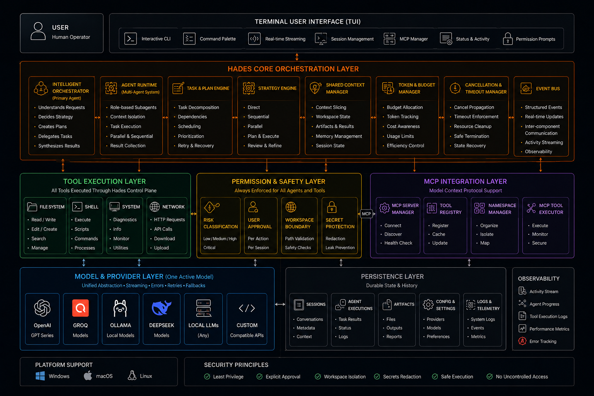
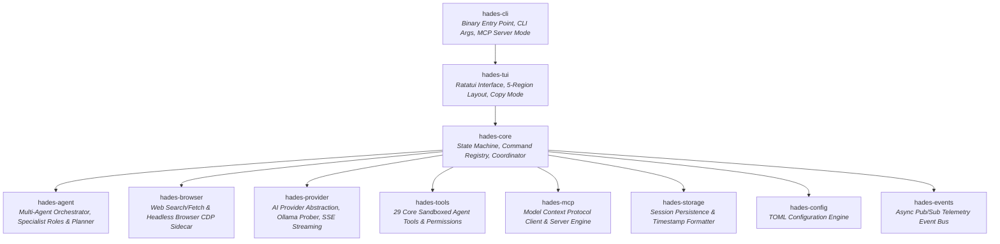

<div align="center">


# HADES-CLI

### Universal AI Agent CLI Runtime

**Any model. Any provider. Any project. Any machine. Any task. One user-controlled AI agent.**

<br/>

[](https://www.npmjs.com/package/@pareekshith/hadey)
[](https://www.rust-lang.org/)
[](LICENSE)
[](https://github.com/PareekshithPalat/HADES_CLI)
[](https://github.com/PareekshithPalat/HADES_CLI/actions/workflows/ci.yml)
[](CONTRIBUTING.md)

<br/>

> **"Any model. Any provider. Any project. Any machine. Any task. One user-controlled AI agent."**

</div>

---

## Quick Start

HADES is distributed globally via npm. No local Rust compilation required.

### 1. Install Globally

```bash
npm install -g @pareekshith/hadey
```

### 2. Launch

Run `hadey` inside any project directory or repository:

```bash
hadey
```

### 3. Connect a Model

- Press `/` to open the command palette and select `/model`.
- Choose your provider:
  - **Local (Free & Offline)**: Select **Ollama** (automatically detects models on `localhost:11434`).
  - **Cloud Providers**: Select **OpenAI**, **Groq**, **DeepSeek**, or **Custom OpenAI-Compatible** and provide your API key.
- Start building, debugging, refactoring, and automating!

---

## Overview

**Hades** is a high-performance, universal AI agent CLI runtime engineered from the ground up in Rust. Built for software engineers, DevOps practitioners, and developers who demand speed, privacy, and full control over their workflows, Hades connects cloud LLMs and offline local models into a unified, sandboxed terminal cockpit.

Unlike browser-based assistants or opaque cloud coding tools, Hades executes natively on your machine with a strict permission engine, multi-agent orchestration, web intelligence, and Model Context Protocol (MCP) extensibility.

```
                  ┌─────────────────────────────────────────────────────────┐
                  │                        HADES-CLI                        │
                  │             Universal AI Agent CLI Runtime              │
                  └────────────────────────────┬────────────────────────────┘
                                               │
       ┌───────────────────────┬───────────────┴───────────────┬───────────────────────┐
       ▼                       ▼                               ▼                       ▼
┌──────────────┐      ┌─────────────────┐             ┌─────────────────┐     ┌─────────────────┐
│  AI Engine   │      │ 51-Tool Sandbox │             │   Multi-Agent   │     │ Web & Browser   │
│ OpenAI / Groq│      │ Filesystem, OS, │             │  Orchestration  │     │ Direct Search & │
│ DeepSeek     │      │ Shell, Network, │             │ Planner, Coder, │     │ Fetch, Headless │
│ Local Ollama │      │ Process & Runtime│            │ Reviewer, DevOps│     │ Chromium Sidecar│
└──────────────┘      └─────────────────┘             └─────────────────┘     └─────────────────┘
```

---

## Architecture & Features

<div align="center">
  
</div>

---

## Key Capabilities

### 1. Universal Model & Provider Engine
- **Cloud & Local Integration**: Seamlessly switch between cloud providers (OpenAI, Groq, DeepSeek, OpenRouter) and offline local models (Ollama, LM Studio, vLLM, LocalAI).
- **Auto-Discovery for Local Models**: Automatically discovers local Ollama daemon instances (`http://127.0.0.1:11434`) and lists installed models with zero manual setup.
- **Dynamic Capability Probing**: Inspects model capabilities on the fly (streaming, tool payloads, JSON schema validation, context window size).
- **Secure Credential Vault**: API keys are securely stored in local encrypted files (`~/.hades/credentials.json`) and automatically redacted from logs, transcripts, and UI viewports.

### 2. Sandboxed Tool Execution (51 Built-in Tools)
- **Filesystem & Codebase Operations**: Safe file creation, surgical line-based editing, directory scanning, and deletion within validated workspace boundaries.
- **Shell & Process Management**: Run build scripts, test suites, and terminal commands with configurable timeouts and output truncation guards.
- **System & Network Diagnostics**: Inspect CPU, memory, uptime, open ports, socket states, and running processes with PID resolution.
- **Path Traversal Sandboxing**: Strict boundary enforcement confines agent operations to the designated workspace root to prevent unintended system escapes.
- **Interactive Risk Approvals**: Dangerous actions (`system.process.terminate`, destructive shell commands, custom evaluations) require explicit interactive user approval (`Allow Once`, `Allow Session`, `Deny`).

### 3. Multi-Agent Orchestration & Specialist Roles
- **Hierarchical Agent Dispatch**: The orchestrator decomposes complex tasks into structured plans and coordinates specialist subagents.
- **Dedicated Agent Roles**:
  - **Architect**: System design, directory structure planning, and architectural reviews.
  - **Coder**: Code implementation, refactoring, and bug fixes.
  - **Researcher**: Codebase exploration, dependency inspection, and documentation retrieval.
  - **Reviewer**: Code quality analysis, lint checks, and test coverage verification.
  - **Security Auditor**: Vulnerability scanning, permission auditing, and secret leak detection.
  - **DevOps**: Build optimization, containerization, CI/CD scripts, and environment configuration.
  - **Browser Agent & Web Testing Agent**: Web exploration, live UI testing, and network diagnostics.

### 4. Web Intelligence & Headless Browser Sidecar
- **Zero-Overhead Search & Fetch**:
  - **Direct HTTP Search (`web.search`)**: Fast DuckDuckGo search queries returning titles, URLs, and snippets without browser overhead.
  - **Direct HTTP Fetch (`web.fetch`)**: Sanitizes HTML to clean, readable Markdown stripped of ads, scripts, and tracking tags.
- **Headless Browser Automation (`browser.*`)**:
  - Automatically discovers local Chrome, Chromium, Microsoft Edge, and Brave installations.
  - Communicates directly via Chrome DevTools Protocol (CDP) over WebSockets.
  - **Accessibility-First Snapshots**: Maps interactive DOM nodes to stable identifiers (`[ref_001] button "Submit"`).
  - Dispatches clicks, form fills, keypresses, and scrolling with built-in loop detection tripwires.
  - Generates high-resolution screenshots and PDF artifacts.
  - Live inspection of JavaScript console logs and network traffic.

### 5. Model Context Protocol (MCP) Integration
- **Client & Server Support**: Implements the official MCP standard (`protocolVersion: 2024-11-05`).
- **STDIO & Streamable HTTP Transports**: Connects to community MCP servers (`npx`, `uvx`, `python`, `docker`).
- **Dynamic Tool Namespacing**: External tools are automatically registered (e.g. `github.create_issue`, `postgres.query_schema`) and guarded by HADES risk assessment.
- **Hades as an MCP Server**: Expose HADES workspace inspection and diagnostics directly to Claude Desktop, Cursor, or external agents:
  ```bash
  hadey mcp-server --workspace /path/to/project
  ```

### 6. Full-Screen Terminal Interface (Ratatui TUI)
- **Fiery Dark-Mode Gradient**: High-contrast theme featuring the HADES trident identity (`🜲 HADES`).
- **5-Region Responsive Layout**: Fixed header border, scrollable conversation viewport, multi-line prompt input, status bar, and keymap footer.
- **Real-Time Token Streaming**: Low-latency rendering with manual scroll lock and incremental line navigation.
- **Interactive Copy Mode (`Ctrl+Y`)**: Extract clean Markdown text directly to the system clipboard across macOS, Linux, and Windows.
- **Command Palette (`/`)**: Access slash commands, session management, tool lists, and settings with fuzzy autocompletion.

---

## Usage Instructions & Workflows

### Launching HADES

```bash
# Launch interactive TUI in current working directory
hadey

# Launch in a specific project workspace
cd /path/to/my-project && hadey

# Resume a previous conversation session by ID
hadey --session 3f9a1b2c-4d5e-6f7a-8b9c-0d1e2f3a4b5c

# Launch with custom configuration and data paths
hadey --config ~/.config/hades/custom.toml --data-dir ~/my_hades_storage

# Launch as a background Model Context Protocol (MCP) server
hadey mcp-server --workspace /path/to/project
```

### CLI Arguments

```text
Usage: hadey [OPTIONS] [COMMAND]

Commands:
  mcp-server  Launch Hades in Model Context Protocol (MCP) server mode over STDIO
  help        Print this message or the help of the given subcommand(s)

Options:
  -c, --config <FILE>        Custom path to configuration file (default: ~/.hades/config.toml)
  -d, --data-dir <DIR>       Custom directory for persistent storage (default: ~/.hades/data)
  -l, --log-dir <DIR>        Custom directory for log files (default: ~/.hades/logs)
  -s, --session <SESSION_ID> Resume an existing conversation session by ID
  -h, --help                 Print help
  -V, --version              Print version
```

---

## Configuring AI Providers

Open the interactive model picker inside HADES by typing `/model` in the prompt:

### 1. Ollama (Local & Offline)
1. Install and start Ollama (`ollama serve` or system daemon).
2. Pull your preferred models: `ollama pull llama3.2` or `ollama pull deepseek-r1:7b`.
3. Select `/model` -> **Ollama** in HADES. All local models appear automatically.

### 2. OpenAI
1. Obtain an API key from [platform.openai.com](https://platform.openai.com).
2. Select `/model` -> **OpenAI**.
3. Choose `gpt-4o`, `gpt-4o-mini`, `o1`, or `o3-mini`.
4. Enter your API key (stored securely in `~/.hades/credentials.json`).

### 3. Groq (Ultra-Fast Inference)
1. Get an API key from [console.groq.com](https://console.groq.com).
2. Select `/model` -> **Groq**.
3. Choose `llama-3.3-70b-versatile`, `mixtral-8x7b-32768`, or `deepseek-r1-distill-llama-70b`.

### 4. DeepSeek
1. Get an API key from [platform.deepseek.com](https://platform.deepseek.com).
2. Select `/model` -> **Custom OpenAI-Compatible**.
3. Base URL: `https://api.deepseek.com`, Model: `deepseek-chat` or `deepseek-reasoner`.

### 5. Custom OpenAI-Compatible Endpoints (vLLM / LM Studio / LocalAI)
1. Select `/model` -> **Custom OpenAI-Compatible**.
2. Base URL: `http://localhost:1234/v1` (LM Studio) or `http://localhost:8000/v1` (vLLM).
3. Specify Model Identifier and optional Bearer token.

---

## Keyboard Shortcuts & Navigation

| Key Binding | Context | Action |
| :--- | :--- | :--- |
| `[Input]` + `Enter` | Prompt Input | Submit message or instruction to active agent. |
| `/` | Empty Prompt | Open interactive Command Palette. |
| `Ctrl + Y` | Active Viewport | Open Interactive Copy Mode (export turn to clipboard). |
| `Ctrl + C` | Global | Cancel streaming response or exit application cleanly. |
| `Up` / `Down` | Viewport | Scroll conversation view line-by-line. |
| `PageUp` / `PageDn` | Viewport | Scroll conversation view by full screen page. |
| `Home` / `End` | Viewport | Jump to beginning or end of conversation history. |
| `Enter` | Modals & Dialogs | Confirm modal selection or execute selected palette action. |
| `Esc` | Modals & Dialogs | Dismiss modal dialog and return focus to chat. |

---

## Slash Commands Reference

Type `/` in the prompt input field to activate the command palette:

| Command | Arguments | Description |
| :--- | :--- | :--- |
| `/help` | None | Display modal listing all available keyboard shortcuts and slash commands. |
| `/model` | None | Open model picker to switch AI providers and target models. |
| `/tools` | None | Inspect registry of 51 built-in agent tools and external MCP tools. |
| `/browser`| None | Inspect web intelligence status, detected browser binary, and active tabs. |
| `/mcp` | None | Inspect configured Model Context Protocol (MCP) servers, tools, and diagnostics. |
| `/permissions` | None | View security rules, permission scopes, and risk levels for active session. |
| `/workspace` | None | View active workspace root directory path and detected project metadata. |
| `/sessions` | None | Open session manager to view, rename, switch, or delete saved conversations. |
| `/new` | None | Create a new isolated conversation session. |
| `/switch` | None | Quick-switch to a recent conversation session. |
| `/status` | None | View active model status, system health, context token usage, and storage stats. |
| `/exit` | None | Save session state and exit HADES cleanly. |

---

## Built-in Agent Tools Reference (51 Tools)

### Core System & Filesystem Tools (`hades-tools`)

| Category | Tool Identifier | Risk Level | Description |
| :--- | :--- | :--- | :--- |
| **Filesystem** | `filesystem.read` | Safe | Read full or partial line ranges of workspace files. |
| | `filesystem.write` | Low | Write new contents to specified workspace file paths. |
| | `filesystem.edit` | Low | Perform surgical, line-targeted replacements in existing files. |
| | `filesystem.create` | Low | Create empty files or directories within workspace sandbox. |
| | `filesystem.delete` | High | Delete specified workspace files *(Requires confirmation)*. |
| | `filesystem.list` | Safe | List directory trees and file metadata within workspace. |
| **Workspace** | `workspace.info` | Safe | Retrieve project name, language detection, and structure details. |
| | `workspace.scan` | Safe | Scan workspace tree for configuration files and build manifests. |
| | `workspace.dependencies` | Safe | Parse package manifests (Cargo.toml, package.json, pyproject.toml, go.mod). |
| **Shell & Execution**| `shell.execute` | High | Execute terminal commands with timeout limits *(Requires confirmation)*. |
| **Environment** | `environment.get` | Safe | Read specific environment variable values with auto-redaction. |
| | `environment.list` | Safe | List defined environment variables with credential masking. |
| | `environment.set` | Low | Set session-level environment variables for child processes. |
| **System Info** | `system.info` | Safe | Host machine diagnostics: OS kernel, system load, hostname, uptime. |
| | `system.platform` | Safe | Identify operating system platform (macOS, Linux, Windows). |
| | `system.architecture` | Safe | Inspect CPU architecture (x86_64, aarch64). |
| | `system.hostname` | Safe | Retrieve network node hostname. |
| | `system.uptime` | Safe | Inspect host uptime in seconds and formatted duration. |
| **Process Control** | `system.process.list` | Safe | List running system processes with PID, CPU, and memory metrics. |
| | `system.process.inspect` | Safe | Detailed view of process memory footprint, arguments, and status. |
| | `system.process.find` | Safe | Search active processes by executable name or keyword regex. |
| | `system.process.terminate`| Critical | Terminate running process by PID *(Requires interactive approval)*. |
| **Network** | `system.network.interfaces` | Safe | List active network hardware interfaces and IP addresses. |
| | `system.network.port_check` | Safe | Test TCP socket accessibility on host or remote address. |
| | `system.network.port_process` | Safe | Resolve process PID owning a specified TCP/UDP listening port. |
| | `system.network.connections` | Safe | List active TCP socket connections and socket states. |
| **Runtime & PATH** | `system.runtime.which` | Safe | Locate binary path of executables present on host `PATH`. |
| | `system.runtime.version` | Safe | Determine installed version string of runtime binaries (node, rustc, python). |

### Web Intelligence & Browser Automation Tools (`hades-browser`)

| Category | Tool Identifier | Risk Level | Description |
| :--- | :--- | :--- | :--- |
| **Web Retrieval** | `web.search` | Safe | Perform direct DuckDuckGo web search without launching a browser. |
| | `web.fetch` | Safe | Fetch web page and extract clean Markdown (strips scripts, styles, SVGs). |
| **Browser Sidecar** | `browser.start` | Low | Launch headless browser sidecar process (Chrome, Edge, Brave). |
| | `browser.close` | Safe | Terminate browser session and clean up temporary profiles. |
| | `browser.status` | Safe | Inspect browser runtime state, detected binary, and active tabs. |
| | `browser.tabs` | Safe | List open browser tabs and URLs. |
| | `browser.open` | Safe | Navigate active browser tab to a specified URL. |
| | `browser.snapshot` | Safe | Capture accessibility tree mapping interactive DOM nodes to refs. |
| | `browser.extract_text` | Safe | Extract visible text content from the active webpage. |
| | `browser.extract_markdown` | Safe | Convert live rendered DOM structure to formatted Markdown. |
| | `browser.get_links` | Safe | Extract all links (`<a>` tags) and destination URLs from current page. |
| | `browser.get_page_info` | Safe | Retrieve page title, URL, viewport dimensions, and metadata. |
| | `browser.click` | Medium | Click an interactive element by reference (`ref_001`) or selector. |
| | `browser.fill` | Medium | Clear and type text into an input field by reference or selector. |
| | `browser.select` | Medium | Select dropdown option in `<select>` elements. |
| | `browser.scroll` | Safe | Scroll page viewport up, down, or to a specific coordinate. |
| | `browser.hover` | Safe | Hover pointer over a specific element reference. |
| | `browser.press_key` | Medium | Send keyboard keypresses (Enter, Tab, Escape, Arrow keys). |
| | `browser.screenshot` | Safe | Capture high-resolution viewport or full-page PNG screenshot artifact. |
| | `browser.pdf` | Safe | Print current webpage to a PDF document artifact. |
| | `browser.console` | Safe | Retrieve live JavaScript console logs and browser error entries. |
| | `browser.network` | Safe | Inspect live HTTP network requests, headers, and status codes. |
| | `browser.evaluate` | High | Execute sandboxed JavaScript expression in page context. |

---

## Configuration Reference (`~/.hades/config.toml`)

HADES automatically initializes `~/.hades/config.toml` on first run:

```toml
# General System Settings
[general]
app_name = "hadey"
default_mode = "simple"

# Terminal Interface Settings
[ui]
theme = "dark"
show_status_bar = true

# Active Model & Provider Settings
[model]
provider_id = "groq"
model_id = "llama-3.3-70b-versatile"

# Browser Sidecar & Web Settings
[browser]
enabled = true
mode = "isolated"              # "isolated" (temp profile) or "persistent"
preferred_browser = "auto"     # "auto", "chrome", "chromium", "edge", "brave"
headless = true
default_timeout_seconds = 30
max_actions_per_task = 100
max_tabs = 10

# Model Context Protocol (MCP) Configuration
[mcp]
enabled = true

[mcp.servers.github]
transport = "stdio"
command = "npx"
args = ["-y", "@modelcontextprotocol/server-github"]
token_env = "GITHUB_TOKEN"
timeout_secs = 30
enabled = true
auto_start = true

[mcp.servers.postgres]
transport = "stdio"
command = "npx"
args = ["-y", "@modelcontextprotocol/server-postgres", "postgresql://localhost/mydb"]
enabled = false
auto_start = false
```

---

## Workspace Architecture

HADES is built as a modular, decoupled Cargo workspace consisting of 11 dedicated crates:



### Crates Catalog

| Crate | Purpose |
| :--- | :--- |
| [`crates/hades-cli`](crates/hades-cli) | Main binary entry point, CLI arguments parsing via `clap`, file logging, and MCP server mode. |
| [`crates/hades-tui`](crates/hades-tui) | Full-screen terminal UI built on `ratatui` and `crossterm`. 5-region layout, clipboard export, and theme rendering. |
| [`crates/hades-core`](crates/hades-core) | Central application orchestrator, state machine (`AppState`), command registry, and execution loop. |
| [`crates/hades-agent`](crates/hades-agent) | Multi-agent orchestration, specialist agent roles, task decomposition, and decision engine. |
| [`crates/hades-browser`](crates/hades-browser) | Direct HTTP search & fetch, headless Chromium/Edge/Brave sidecar, CDP client, and accessibility snapshots. |
| [`crates/hades-provider`](crates/hades-provider) | Universal provider abstraction (`Provider`), model managers, local Ollama prober, credential vault, SSE streaming. |
| [`crates/hades-tools`](crates/hades-tools) | 29 core sandboxed tools (filesystem, shell, network, process, environment, runtime) and permission engine. |
| [`crates/hades-mcp`](crates/hades-mcp) | Model Context Protocol (MCP) client, multi-server manager, STDIO & HTTP transports, and Hades MCP server mode. |
| [`crates/hades-storage`](crates/hades-storage) | JSON/file session storage, conversation recovery, relative timestamp formatting. |
| [`crates/hades-config`](crates/hades-config) | Schema-validated TOML configuration management at `~/.hades/config.toml`. |
| [`crates/hades-events`](crates/hades-events) | Asynchronous Pub/Sub event bus for telemetry, lifecycle events, and audit logging. |

---

## Building From Source (For Contributors)

If you wish to contribute to HADES or compile directly from source:

### Prerequisites
- **Rust Toolchain**: Rust 1.80.0+ (`rustup update stable`)
- **C/C++ Build Tools**: `build-essential` (Linux), Xcode CLI Tools (macOS), or MSVC/MinGW (Windows)

### Build & Run
```bash
# Clone the repository
git clone https://github.com/PareekshithPalat/HADES_CLI.git
cd HADES_CLI

# Build release binary
cargo build --release

# Run locally
cargo run --bin hades
```

### Quality Assurance & Linting
All contributions must pass the project's strict zero-warning quality gates:

```bash
# 1. Formatting check
cargo fmt --all -- --check

# 2. Workspace compilation check
cargo check --workspace --all-targets

# 3. Full test suite (135+ tests)
cargo test --workspace

# 4. Strict Clippy lint check
cargo clippy --workspace --all-targets --all-features -- -D warnings
```

---

## Contributing

We welcome community contributions, bug reports, and feature requests. Please check [**CONTRIBUTING.md**](CONTRIBUTING.md) for development workflows and submission guidelines.

---

## License

Distributed under the **MIT License**. See [`LICENSE`](LICENSE) for complete details.
