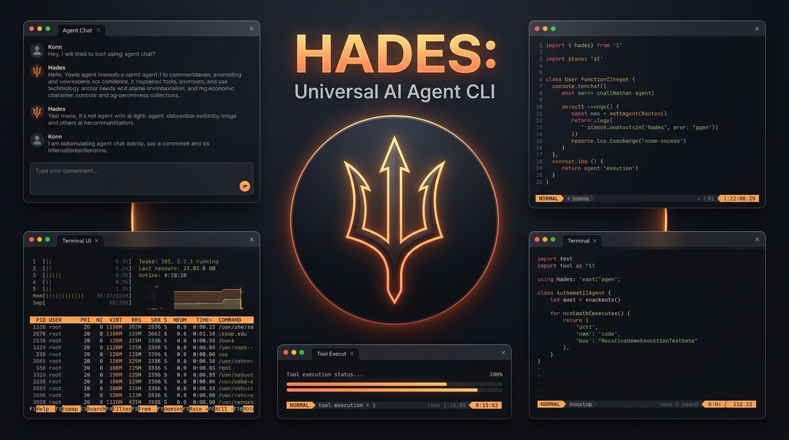
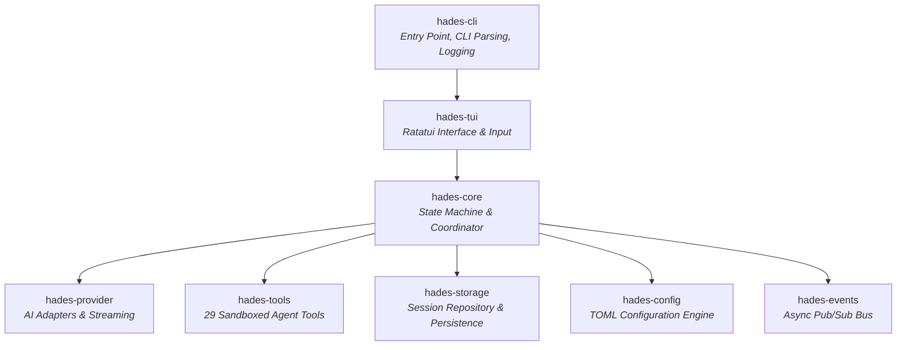

<div align="center">


# HADES
### Universal AI Agent CLI

[](https://github.com/PareekshithPalat/HADES_CLI)
[](https://www.rust-lang.org/)
[](LICENSE)
[](https://github.com/PareekshithPalat/HADES_CLI)
[](https://github.com/PareekshithPalat/HADES_CLI)
[](CONTRIBUTING.md)

<br/>

> **"Any model. Any provider. Any project. Any machine. Any task. One user-controlled AI agent."**

<br/>



</div>

---

## Overview

**Hades** is a high-performance, universal AI agent CLI runtime. Designed for developers who demand total control, speed, and privacy, Hades unifies cloud LLMs (OpenAI, Groq, DeepSeek) and local offline inference engines (Ollama, LM Studio, vLLM) into a single, cohesive, terminal-native workspace.

Equipped with a **29-tool autonomous agent runtime**, a strict **sandboxed permission engine**, **real-time token streaming**, and a full-screen **Ratatui terminal user interface**, Hades provides an interactive and secure cockpit for development, debugging, and system operations.

---

## Architecture & Features


---

## Core Capabilities

### 1. Universal Model & Provider Engine
- **Cloud & Local Integration**: Switch between cloud APIs (OpenAI, Groq, DeepSeek, OpenRouter) and local offline LLMs (Ollama, vLLM, LM Studio).
- **Automatic Local Discovery**: Automatically discovers local Ollama instances (`http://127.0.0.1:11434`) without requiring API keys.
- **Capability Detection**: Proactively identifies provider capabilities including streaming, function calling, tool payloads, and context limits.
- **Credential Protection**: API keys and tokens are securely stored in local backends and automatically redacted from logs, outputs, and terminal viewports.

### 2. Autonomous Tool Execution & Sandbox Engine (29 Built-in Tools)
- **Filesystem & Codebase Operations**: Safe file creation, surgical line-based editing, reading, directory scanning, and deletion within validated workspace boundaries.
- **Shell Command Execution**: Run build tasks, scripts, and commands with configurable timeouts and output capture.
- **System & Hardware Diagnostics**: Inspect OS platform, CPU architecture, host uptime, memory usage, and CPU core metrics.
- **Process Management**: Search, inspect, list, and terminate running processes with memory and CPU usage breakdowns.
- **Network Diagnostics**: Inspect active network interfaces, test TCP socket availability, discover process ownership for ports, and list active connections.
- **Path Traversal Sandboxing**: Strict boundary checks enforce workspace isolation to prevent accidental or malicious path escapes.
- **User Approval Controls**: Mutating actions (`system.process.terminate`, destructive shell commands) require explicit interactive confirmation.

### 3. Full-Screen Terminal Interface
- **Fiery Dark-Mode Palette**: Clean dark theme with vibrant orange and amber accents (`HadesTheme`).
- **Application-Owned Viewport**: Native conversation viewport with smooth auto-scroll, manual scroll lock, and incremental line-by-line scrolling.
- **Structured 5-Region Layout**: Top horizontal border, prompt input row, bottom horizontal border, and pinned status bar.
- **Clean Text Clipboard Export (`Ctrl+Y`)**: Extract clean Markdown text directly to the system clipboard across Windows, macOS, and Linux.
- **Interactive Command Palette (`/`)**: Access slash commands, session management, and configuration dialogs via quick navigation.

### 4. Session Persistence & Context Architecture
- **Multi-Session Isolation**: Persistent session storage with unique UUIDs, dynamic title generation, and disk caching.
- **Deterministic Time Semantics**: Timestamps stored in UTC and formatted relative to the local timezone (*"In use"*, *"Today · 1:42 PM"*, *"Yesterday"*, *"3 days ago"*).
- **Intelligent Context Compaction**: Automatically compacts conversation history for model context limits while preserving full unabridged logs on disk.

---

## Workspace Architecture

Hades is organized into 8 modular crates:



### Crates Catalog

| Crate | Purpose |
| :--- | :--- |
| `hades-cli` | Main binary entry point, argument parsing via `clap`, non-blocking file tracing. |
| `hades-tui` | Terminal user interface built with `ratatui` and `crossterm`. 5-region layout, clipboard, themes. |
| `hades-core` | Core application orchestrator, state machine (`AppState`), command registry, system prompts. |
| `hades-provider` | Pluggable provider abstraction (`Provider`), model managers, credential vault, SSE streaming. |
| `hades-tools` | 29 built-in sandboxed tools, permission engine, secret redactor, path security. |
| `hades-storage` | JSON/file session storage, conversation recovery, relative timestamp formatting. |
| `hades-config` | Schema-validated TOML configuration management at `~/.hades/config.toml`. |
| `hades-events` | Asynchronous Pub/Sub event bus for telemetry, lifecycle events, and audit logs. |

---

## Installation & Quick Start

### Prerequisites

- **Rust toolchain** (version 1.80+ recommended)
- **C/C++ Build Tools** (MSVC / MinGW on Windows, GCC/Clang on Linux & macOS)

### 1. Build from Source

```bash
# Clone the repository
git clone https://github.com/PareekshithPalat/HADES_CLI.git
cd HADES_CLI

# Build all workspace crates
cargo build --release
```

The compiled binary will be located at:
- **Windows**: `target/release/hades.exe`
- **Linux / macOS**: `target/release/hades`

### 2. Launching Hades

```bash
# Run directly with Cargo
cargo run --release -p hades-cli

# Or run the compiled binary
./target/release/hades
```

---

## Command Line Options

```text
Usage: hades [OPTIONS]

Options:
  -c, --config <FILE>     Custom path to configuration file (default: ~/.hades/config.toml)
  -d, --data-dir <DIR>    Custom directory for persistent storage (default: ~/.hades/data)
  -l, --log-dir <DIR>     Custom directory for log files (default: ~/.hades/logs)
  -h, --help              Print help information
  -V, --version           Print version information
```

---

## Provider Setup

### 1. OpenAI (Cloud)
- Press `/` and select `/model`.
- Choose **OpenAI**, select your model (`gpt-4o`, `gpt-4o-mini`, `o1`, `o3-mini`), and enter your API key.

### 2. Groq (Ultra-Fast Inference)
- Obtain an API key from the Groq console.
- Select **Groq** in Hades and choose models such as `llama-3.3-70b-versatile` or `mixtral-8x7b-32768`.

### 3. Ollama (Local & Private)
1. Ensure Ollama is running locally:
   ```bash
   ollama serve
   ollama run llama3.2
   ```
2. In Hades, press `/` and select `/model` → **Ollama**.
3. Hades automatically discovers all locally installed models without requiring API keys.

### 4. Custom OpenAI-Compatible Endpoints
- Select **Custom OpenAI-Compatible** to connect to self-hosted instances (vLLM, LM Studio, LocalAI, DeepSeek API):
  - **Base URL**: `http://localhost:1234/v1` (or remote endpoint)
  - **API Key**: Optional / token

---

## Built-in Agent Tools (29 Tools)

| Category | Tools | Description |
| :--- | :--- | :--- |
| **Filesystem** | `filesystem.read`<br/>`filesystem.write`<br/>`filesystem.edit`<br/>`filesystem.create`<br/>`filesystem.delete`<br/>`filesystem.list` | Inspect, create, edit, and organize files within the workspace sandbox. |
| **Workspace** | `workspace.info`<br/>`workspace.scan`<br/>`workspace.dependencies` | Automatic project type detection (Rust, Node.js, Python, Go) and dependency analysis. |
| **Shell & Execution** | `shell.execute` | Execute system shell commands and build scripts with timeouts and output bounds. |
| **Environment** | `environment.get`<br/>`environment.list`<br/>`environment.set` | Inspect and configure session environment variables with automatic secret redaction. |
| **System Info** | `system.info`<br/>`system.platform`<br/>`system.architecture`<br/>`system.hostname`<br/>`system.uptime` | Host diagnostics: OS kernel, CPU architecture, hostname, memory usage, uptime. |
| **Process Control** | `system.process.list`<br/>`system.process.inspect`<br/>`system.process.find`<br/>`system.process.terminate` | Process management by PID, CPU/memory sorting, pattern search, and process termination *(Requires user approval)*. |
| **Network Diagnostics** | `system.network.interfaces`<br/>`system.network.port_check`<br/>`system.network.port_process`<br/>`system.network.connections` | Network interfaces, TCP port availability checks, port PID ownership lookup, active connections. |
| **Runtime & PATH** | `system.runtime.which`<br/>`system.runtime.version` | Locate executables on system `PATH` and verify installed runtime versions. |

---

## Keyboard Shortcuts & Navigation

| Shortcut | Context | Action |
| :--- | :--- | :--- |
| `[Text]` + `Enter` | Main Input | Submit prompt to active AI model |
| `/` | Empty Input | Open interactive Command Palette |
| `Ctrl + Y` | Running View | Copy latest response / Enter Interactive Turn Copy Mode |
| `Ctrl + C` | Any View | Cancel active generation / Graceful Hades shutdown |
| `Up` / `Down` | Conversation View | Incremental line-by-line scrolling |
| `PageUp` / `PageDn` | Conversation View | Scroll conversation by full page |
| `Home` / `End` | Conversation View | Jump directly to top / bottom of conversation |
| `Enter` | Modals / Lists | Confirm selection / Execute command |
| `Esc` | Modals / Dialogs | Dismiss active modal / Return to conversation |

### Interactive Copy Mode (`Ctrl+Y`)
When in a multi-turn conversation, pressing `Ctrl+Y` opens the **Copy Select Modal**:
- `Up` / `Down`: Navigate through conversation turns.
- `Enter` / `y` / `c`: Copy the selected turn clean text (unpolluted Markdown).
- `a`: Copy the entire conversation to the clipboard.
- `Esc`: Exit copy mode.

---

## Slash Commands

Type `/` in the prompt area to open the interactive command palette:

```text
/help          Display all available commands and keyboard controls
/model         Open the AI provider & model selection interface
/tools         List all 29 registered tools, scopes, and schemas
/permissions   View permission rules and risk classifications
/workspace     Inspect active workspace root and project metadata
/sessions      Open interactive session switcher and manager
/new           Start a fresh conversation session
/switch        Quick-switch between recent conversation sessions
/status        Display system health, active model, and storage metrics
/exit          Save state and gracefully exit Hades
```

---

## Configuration Reference (`config.toml`)

Hades stores its configuration in `~/.hades/config.toml`:

```toml
[general]
default_mode = "simple"
workspace_root = "."
log_level = "info"

[model]
provider = "groq"
model_id = "llama-3.3-70b-versatile"
temperature = 0.7
max_tokens = 4096

[security]
require_approval_for_mutating = true
redact_secrets = true
max_execution_timeout_secs = 30
```

---

## Testing & Quality Assurance

Hades enforces strict quality standards across all crates:

```bash
# 1. Verify code formatting
cargo fmt --all -- --check

# 2. Check workspace compilation
cargo check --workspace --all-targets

# 3. Run all 120+ unit and integration tests
cargo test --workspace

# 4. Strict Clippy lint check with warnings as errors
cargo clippy --workspace --all-targets --all-features -- -D warnings
```

---

## Roadmap

- [x] **Phase 0**: Application lifecycle, event architecture, terminal safety.
- [x] **Phase 1**: Universal Model & Provider engine, token streaming, credentials.
- [x] **Phase 2**: Multi-session persistence, context compaction, time semantics.
- [x] **Phase 3**: 29 sandboxed tools, permission engine, process/network diagnostics.
- [x] **Phase 3.1**: 5-region input layout, clean text clipboard support, fiery TUI theme.
- [ ] **Phase 4**: Model Context Protocol (MCP) server & client integration.
- [ ] **Phase 5**: Multi-agent orchestration and collaborative subagents.
- [ ] **Phase 6**: Built-in headless browser automation sidecar.

---

## Contributing

Contributions are welcome. Please refer to [**CONTRIBUTING.md**](CONTRIBUTING.md) for development prerequisites, architecture guidelines, and pull request procedures.

---

## License

Distributed under the **MIT License**. See [`LICENSE`](LICENSE) for more details.
