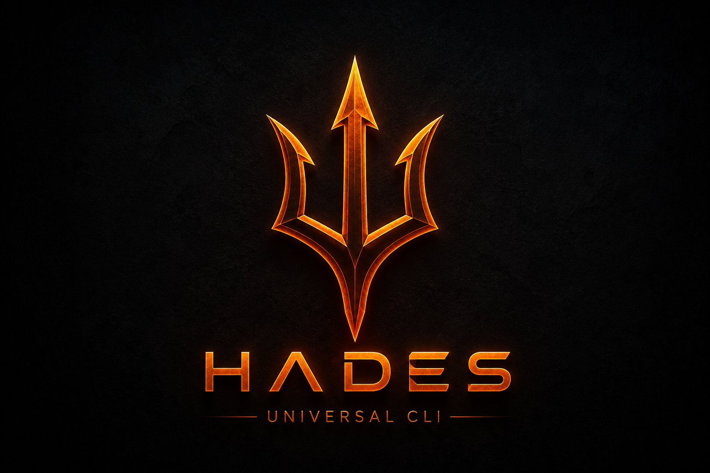
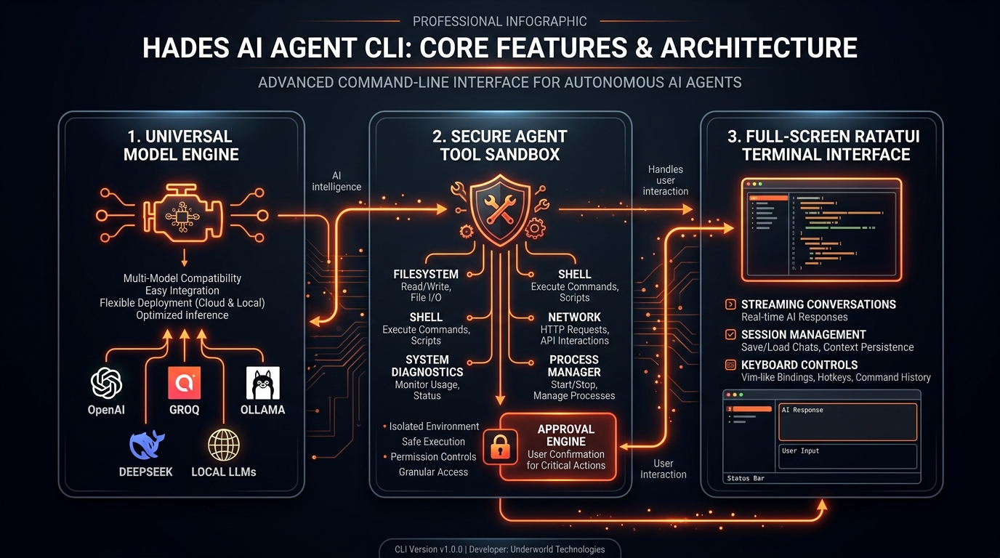
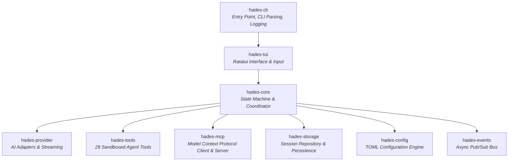

<div align="center">

# <font size="10"><strong>HADES-CLI</strong></font>
### Universal AI Agent CLI Runtime

[](https://github.com/PareekshithPalat/HADES_CLI)
[](https://www.rust-lang.org/)
[](LICENSE)
[](https://github.com/PareekshithPalat/HADES_CLI)
[](https://github.com/PareekshithPalat/HADES_CLI/actions/workflows/ci.yml)
[](CONTRIBUTING.md)

<br/>

> **"Any model. Any provider. Any project. Any machine. Any task. One user-controlled AI agent."**

<br/>



</div>

---

## Overview

**Hades** is a high-performance, universal AI agent CLI runtime engineered in Rust. Designed for software engineers, DevOps practitioners, and system administrators who demand total control, speed, and privacy, Hades unifies cloud LLMs (OpenAI, Groq, DeepSeek, OpenRouter) and local offline inference engines (Ollama, LM Studio, vLLM, LocalAI) into a single, cohesive, terminal-native workspace.

Equipped with a **29-tool autonomous agent runtime**, a strict **sandboxed permission engine**, **real-time token streaming**, and a full-screen **Ratatui terminal user interface**, Hades provides an interactive, low-latency cockpit for development, debugging, code generation, system diagnostics, and shell operation.

---

## Architecture & Features



---

## Core Capabilities

### 1. Universal Model & Provider Engine
- **Cloud & Local Integration**: Seamlessly switch between cloud APIs (OpenAI, Groq, DeepSeek, OpenRouter) and local offline LLMs (Ollama, vLLM, LM Studio).
- **Automatic Local Discovery**: Automatically scans and discovers local Ollama instances (`http://127.0.0.1:11434`) and available models without requiring manual API configuration.
- **Capability Detection**: Dynamically inspects provider capabilities including streaming, function calling, tool payloads, vision, and context windows.
- **Credential Protection**: API keys and tokens are securely stored in local configuration vaults (`~/.hades/credentials.json`) and automatically redacted from logs, state dumps, and terminal viewports.

### 2. Autonomous Tool Execution & Sandbox Engine (29 Built-in Tools)
- **Filesystem & Codebase Operations**: Safe file creation, surgical line-based editing, reading, directory scanning, and deletion within validated workspace boundaries.
- **Shell Command Execution**: Run build tasks, test suites, and system commands with configurable execution timeouts and output bounds.
- **System & Hardware Diagnostics**: Inspect OS platform details, CPU architecture, host uptime, memory allocation, and CPU core utilization.
- **Process Management**: Search, inspect, list, and terminate host processes with detailed memory and CPU usage breakdowns.
- **Network Diagnostics**: Inspect active network interfaces, test TCP socket availability, discover process ownership for open ports, and list active connections.
- **Path Traversal Sandboxing**: Strict boundary enforcement restricts agent operations to the designated workspace root to prevent accidental or malicious system escapes.
- **User Approval Controls**: Mutating actions (`system.process.terminate`, destructive shell commands) require explicit interactive user confirmation before execution.

### 3. Full-Screen Terminal Interface
- **Fiery Dark-Mode Palette**: High-contrast terminal color scheme designed for maximum readability across light and dark terminal emulators.
- **Application-Owned Viewport**: Native conversation viewport with auto-scroll, manual scroll lock, and incremental line-by-line navigation.
- **Structured 5-Region Layout**: Pinned header border, scrollable conversation viewport, interactive prompt input row, status bar, and keymap footer.
- **Clean Text Clipboard Export (`Ctrl+Y`)**: Extract clean Markdown text directly to the host system clipboard across macOS, Linux, and Windows.
- **Interactive Command Palette (`/`)**: Access slash commands, session management, tool registries, and configuration dialogs via inline autocompletion.

### 4. Session Persistence & Context Architecture
- **Multi-Session Isolation**: Persistent session storage with unique UUIDs, dynamic title generation, and disk caching (`~/.hades/data`).
- **Deterministic Time Semantics**: Timestamps stored in UTC and formatted relative to the local timezone ("In use", "Today · 1:42 PM", "Yesterday", "3 days ago").
- **Intelligent Context Compaction**: Automatically compacts conversation history to fit model context limits while preserving full, unabridged log transcripts on disk.

---

## Workspace Architecture

Hades is organized as a modular Cargo workspace consisting of 8 focused crates:



### Crates Catalog

| Crate | Purpose |
| :--- | :--- |
| `hades-cli` | Main binary entry point, argument parsing via `clap`, MCP server mode (`hades mcp-server`), file tracing. |
| `hades-tui` | Terminal user interface built with `ratatui` and `crossterm`. 5-region layout, clipboard, themes. |
| `hades-core` | Core application orchestrator, state machine (`AppState`), command registry, system prompts. |
| `hades-provider` | Pluggable provider abstraction (`Provider`), model managers, credential vault, SSE streaming. |
| `hades-tools` | 29 built-in sandboxed tools, permission engine, secret redactor, path security. |
| `hades-mcp` | Model Context Protocol (MCP) client, multi-server manager, STDIO & HTTP transports, Hades MCP server mode. |
| `hades-storage` | JSON/file session storage, conversation recovery, relative timestamp formatting. |
| `hades-config` | Schema-validated TOML configuration management at `~/.hades/config.toml`. |
| `hades-events` | Asynchronous Pub/Sub event bus for telemetry, lifecycle notifications, and audit logs. |

---

## System Requirements

| Requirement | Minimum | Recommended |
| :--- | :--- | :--- |
| **OS** | macOS 12+ (Intel / Apple Silicon)<br/>Linux (Kernel 5.4+ x86_64 / aarch64) | macOS 14+ / Ubuntu 22.04 LTS+ / Fedora 38+ |
| **Rust Toolchain** | Rust 1.80.0 | Latest Stable Rust (`rustup update stable`) |
| **C/C++ Compiler** | Clang (macOS) / GCC (Linux) | System default C toolchain |
| **Terminal** | Any UTF-8 terminal with 256-color support | iTerm2, Alacritty, Kitty, WezTerm, GNOME Terminal |
| **Local LLM Runtime** | Ollama (Optional for offline inference) | Ollama 0.3.0+ |

---

## macOS Setup & Installation Guide

### Prerequisites for macOS

1. **Install Xcode Command Line Tools**:
   ```bash
   xcode-select --install
   ```

2. **Install Rust Toolchain**:
   If Rust is not installed, run the official `rustup` installer:
   ```bash
   curl --proto '=https' --tlsv1.2 -sSf https://sh.rustup.rs | sh
   ```
   Ensure the Rust binary path is added to your shell profile:
   ```bash
   source "$HOME/.cargo/env"
   ```

3. **Verify Rust Version**:
   ```bash
   rustc --version
   cargo --version
   ```
   *Requirement: Rust 1.80.0 or higher.*

---

### macOS Build and Installation Steps

1. **Clone the Repository**:
   ```bash
   git clone https://github.com/PareekshithPalat/HADES_CLI.git
   cd HADES_CLI
   ```

2. **Build Release Binary**:
   ```bash
   cargo build --release
   ```
   The compiled binary will be generated at `target/release/hades`.

3. **Install Binary to User Path**:
   Copy the binary to a directory on your `$PATH` (e.g., `~/.local/bin` or `/usr/local/bin`):
   ```bash
   # Option A: User local binary directory (Recommended)
   mkdir -p ~/.local/bin
   cp target/release/hades ~/.local/bin/

   # Option B: System-wide binary directory
   sudo cp target/release/hades /usr/local/bin/
   ```

4. **Configure Shell PATH (if using `~/.local/bin`)**:
   Add the following line to your `~/.zshrc` (or `~/.bash_profile`):
   ```bash
   export PATH="$HOME/.local/bin:$PATH"
   ```
   Reload shell configuration:
   ```bash
   source ~/.zshrc
   ```

5. **Initialize Configuration Directory**:
   ```bash
   mkdir -p ~/.hades/{data,logs}
   ```

---

### Setting Up Local LLM Inference on macOS (Ollama)

1. **Install Ollama via Homebrew**:
   ```bash
   brew install ollama
   ```

2. **Start Ollama Service**:
   ```bash
   ollama serve
   ```

3. **Pull Recommended Models**:
   ```bash
   ollama run llama3.2
   ```

4. **Launch Hades**:
   Hades will automatically detect your local Ollama instance running at `http://127.0.0.1:11434`.

---

## Linux Setup & Installation Guide

### Prerequisites for Linux

Hades requires standard C build utilities, SSL headers, and clipboard system packages depending on your Linux distribution and display server (X11 or Wayland).

#### Ubuntu / Debian / Linux Mint
```bash
sudo apt update
sudo apt install -y build-essential pkg-config libssl-dev git curl xclip wl-clipboard
```

#### Fedora / RHEL / CentOS
```bash
sudo dnf groupinstall -y "Development Tools"
sudo dnf install -y pkg-config openssl-devel git curl xclip wl-clipboard
```

#### Arch Linux / Manjaro
```bash
sudo pacman -Syu --needed base-devel openssl git curl xclip wl-clipboard
```

#### Alpine Linux
```bash
sudo apk add build-base openssl-dev pkgconf git curl xclip wl-clipboard
```

---

### Linux Build and Installation Steps

1. **Install Rust via Rustup**:
   ```bash
   curl --proto '=https' --tlsv1.2 -sSf https://sh.rustup.rs | sh
   source "$HOME/.cargo/env"
   ```

2. **Clone the Repository**:
   ```bash
   git clone https://github.com/PareekshithPalat/HADES_CLI.git
   cd HADES_CLI
   ```

3. **Compile Optimized Release Binary**:
   ```bash
   cargo build --release
   ```

4. **Install Binary System-Wide or User-Local**:
   ```bash
   # System-wide installation
   sudo install -m 0755 target/release/hades /usr/local/bin/hades

   # Or user-local installation
   mkdir -p ~/.local/bin
   install -m 0755 target/release/hades ~/.local/bin/hades
   ```

5. **Verify Environment Variables**:
   Ensure terminal environment supports UTF-8 and 256 colors:
   ```bash
   export TERM=xterm-256color
   export LANG=en_US.UTF-8
   ```

6. **Initialize Data Directories**:
   ```bash
   mkdir -p ~/.hades/data ~/.hades/logs
   ```

---

### Setting Up Local LLM Inference on Linux (Ollama)

1. **Install Ollama Service**:
   ```bash
   curl -fsSL https://ollama.com/install.sh | sh
   ```

2. **Enable and Start Systemd Daemon**:
   ```bash
   sudo systemctl enable --now ollama
   ```

3. **Verify Service Health**:
   ```bash
   curl http://127.0.0.1:11434/api/version
   ```

4. **Pull Local Models**:
   ```bash
   ollama pull llama3.2
   ollama pull deepseek-r1:7b
   ```

---

## Usage Instructions & Workflows

### Launching Hades

```bash
# Launch interactive TUI runtime in current working directory
hades

# Launch pointing to a specific project workspace
cd /path/to/my-project && hades

# Launch with custom configuration file
hades --config ~/.config/hades/custom-config.toml

# Specify custom storage directory
hades --data-dir ~/hades_storage --log-dir ~/hades_logs
```

---

### Command Line Options

```text
Usage: hades [OPTIONS]

Options:
  -c, --config <FILE>     Custom path to configuration file (default: ~/.hades/config.toml)
  -d, --data-dir <DIR>    Custom directory for persistent storage (default: ~/.hades/data)
  -l, --log-dir <DIR>     Custom directory for log files (default: ~/.hades/logs)
  -h, --help              Print help information
  -V, --version           Print version information
```

---

### Provider Setup Workflow

#### 1. OpenAI Setup (Cloud)
1. Press `/` to open the command palette and select `/model`.
2. Choose **OpenAI**.
3. Select desired model (`gpt-4o`, `gpt-4o-mini`, `o1`, `o3-mini`).
4. Input your OpenAI API key when prompted. Keys are encrypted and stored in `~/.hades/credentials.json`.

#### 2. Groq Setup (Ultra-Fast Inference)
1. Obtain an API key from the Groq console.
2. Select `/model` -> **Groq** in Hades.
3. Choose a model (`llama-3.3-70b-versatile`, `mixtral-8x7b-32768`, `deepseek-r1-distill-llama-70b`).
4. Enter your API key.

#### 3. DeepSeek Setup (Cloud API)
1. Generate an API key in the DeepSeek Developer Platform.
2. Select `/model` -> **Custom OpenAI-Compatible** or **DeepSeek**.
3. Configure base URL: `https://api.deepseek.com`
4. Select `deepseek-chat` or `deepseek-reasoner`.

#### 4. Ollama Setup (Local Offline)
1. Ensure Ollama daemon is running (`ollama serve` or systemd service).
2. Open `/model` -> **Ollama** in Hades.
3. Hades automatically queries local endpoints and lists all pulled models without requiring API keys.

#### 5. Custom OpenAI-Compatible Endpoints (vLLM / LM Studio / LocalAI)
1. Select `/model` -> **Custom OpenAI-Compatible**.
2. Set Endpoint URL (e.g., `http://localhost:1234/v1` for LM Studio or `http://localhost:8000/v1` for vLLM).
3. Specify Model Identifier and optional token authentication headers.

---

## Built-in Agent Tools (29 Tools)

Hades includes 29 specialized tools divided into logical capability categories. All tool calls execute within strict workspace boundary constraints.

| Category | Tool Identifier | Risk Level | Description |
| :--- | :--- | :--- | :--- |
| **Filesystem** | `filesystem.read` | Safe | Read full or partial line ranges of workspace files. |
| | `filesystem.write` | Low | Write new contents to specified workspace file paths. |
| | `filesystem.edit` | Low | Perform surgical, line-targeted replacements in existing files. |
| | `filesystem.create` | Low | Create empty files or directories within workspace sandbox. |
| | `filesystem.delete` | High | Delete specified workspace files *(Requires confirmation)*. |
| | `filesystem.list` | Safe | List directory trees and file metadata within workspace. |
| **Workspace** | `workspace.info` | Safe | Retrieve project name, language detection, and structure details. |
| | `workspace.scan` | Safe | Scan workspace tree for configuration files and build manifests. |
| | `workspace.dependencies` | Safe | Parse package manifests (Cargo.toml, package.json, pyproject.toml, go.mod). |
| **Shell & Execution**| `shell.execute` | High | Execute terminal commands with timeout limits *(Requires confirmation)*. |
| **Environment** | `environment.get` | Safe | Read specific environment variable values with auto-redaction. |
| | `environment.list` | Safe | List defined environment variables with credential masking. |
| | `environment.set` | Low | Set session-level environment variables for child processes. |
| **System Info** | `system.info` | Safe | Host machine diagnostics: OS kernel, system load, hostname, uptime. |
| | `system.platform` | Safe | Identify operating system platform (macOS, Linux, Windows). |
| | `system.architecture` | Safe | Inspect CPU architecture (x86_64, aarch64). |
| | `system.hostname` | Safe | Retrieve network node hostname. |
| | `system.uptime` | Safe | Inspect host uptime in seconds and formatted duration. |
| **Process Control** | `system.process.list` | Safe | List running system processes with PID, CPU, and memory metrics. |
| | `system.process.inspect` | Safe | Detailed view of process memory footprint, arguments, and status. |
| | `system.process.find` | Safe | Search active processes by executable name or keyword regex. |
| | `system.process.terminate`| Critical | Terminate running process by PID *(Requires interactive approval)*. |
| **Network** | `system.network.interfaces` | Safe | List active network hardware interfaces and IP addresses. |
| | `system.network.port_check` | Safe | Test TCP socket accessibility on host or remote address. |
| | `system.network.port_process` | Safe | Resolve process PID owning a specified TCP/UDP listening port. |
| | `system.network.connections` | Safe | List active TCP socket connections and socket states. |
| **Runtime & PATH** | `system.runtime.which` | Safe | Locate binary path of executables present on host `PATH`. |
| | `system.runtime.version` | Safe | Determine installed version string of runtime binaries (node, rustc, python). |

---

## Keyboard Shortcuts & Navigation

| Key Binding | Context | Action |
| :--- | :--- | :--- |
| `[Input]` + `Enter` | Prompt Input | Submit prompt query or instruction to active model. |
| `/` | Empty Prompt | Open interactive Command Palette. |
| `Ctrl + Y` | Active Viewport | Launch Interactive Copy Mode for text export. |
| `Ctrl + C` | Global | Cancel active generation stream or exit application cleanly. |
| `Up` / `Down` | Conversation Viewport | Scroll conversation view line-by-line. |
| `PageUp` / `PageDn` | Conversation Viewport | Scroll conversation view by full screen page. |
| `Home` / `End` | Conversation Viewport | Jump directly to start or end of conversation history. |
| `Enter` | Modals & Selection | Confirm modal selection or execute selected palette action. |
| `Esc` | Modals & Dialogs | Dismiss modal dialog and return focus to conversation viewport. |

### Interactive Copy Mode (`Ctrl+Y`)

When reviewing multi-turn agent responses, press `Ctrl+Y` to enter the **Copy Select Modal**:
- `Up` / `Down`: Highlight specific conversation turns (user query or assistant response).
- `Enter` / `y` / `c`: Copy highlighted response text (unpolluted Markdown) to system clipboard.
- `a`: Copy full conversation log to clipboard.
- `Esc`: Cancel copy selection and return to terminal viewport.

---

## Slash Commands Reference

Type `/` in the prompt input field to activate the interactive command palette:

| Command | Arguments | Description |
| :--- | :--- | :--- |
| `/help` | None | Display modal listing all available keyboard shortcuts and slash commands. |
| `/model` | None | Open interactive model picker to switch AI providers and target models. |
| `/tools` | None | View registry of 29 built-in agent tools and external MCP tools. |
| `/mcp` | None | Inspect configured Model Context Protocol (MCP) servers, tools, and diagnostics. |
| `/permissions` | None | Display security rules, permission scopes, and risk levels for active session. |
| `/workspace` | None | Inspect current workspace root directory path and detected project metadata. |
| `/sessions` | None | Open session manager to view, rename, switch, or delete saved conversations. |
| `/new` | None | Create a new isolated conversation session. |
| `/switch` | None | Quick-switch to recent conversation session. |
| `/status` | None | View active model status, system health, context token usage, and storage stats. |
| `/exit` | None | Save session state and exit Hades cleanly. |

---

## Model Context Protocol (MCP) Integration

Hades supports the official **Model Context Protocol (MCP)** specification (`protocolVersion: 2024-11-05`), enabling seamless interoperability with external tool ecosystems and services:

- **STDIO & Streamable HTTP Transports**: Connect to local CLI tools (`npx`, `uvx`, `python`, `docker`) or remote MCP HTTP endpoints.
- **Dynamic Tool Namespacing**: Discovered MCP tools are cleanly namespaced (`<server>.<tool_name>`, e.g. `github.create_issue`, `postgres.query_schema`) and dynamically registered into the central tool registry.
- **Unified Permission & Risk Classification**: External MCP tools undergo automated safety risk assessment (`Safe`, `Low`, `Medium`, `High`, `Critical`) and trigger interactive approval modals for mutating actions.
- **Resources & Prompts**: Discover and read remote MCP resources and prompt templates.
- **Hades MCP Server Mode**: Expose Hades workspace inspection and diagnostic tools to external clients (Cursor, Claude Desktop, autonomous agents):
  ```bash
  hades mcp-server --workspace /path/to/project
  ```

---

## Configuration Reference (`config.toml`)

Hades loads configuration settings from `~/.hades/config.toml`. If the file does not exist, Hades automatically generates a default configuration on first launch.

```toml
# General System Configuration
[general]
app_name = "hades"
default_mode = "simple"

[ui]
theme = "dark"
show_status_bar = true

# Default Model & Provider Configuration
[model]
provider_id = "groq"
model_id = "llama-3.3-70b-versatile"

# Model Context Protocol (MCP) Configuration
[mcp]
enabled = true

[mcp.servers.github]
transport = "stdio"
command = "npx"
args = ["-y", "@modelcontextprotocol/server-github"]
token_env = "GITHUB_TOKEN"
timeout_secs = 30
enabled = true
auto_start = true

[mcp.servers.postgres]
transport = "stdio"
command = "npx"
args = ["-y", "@modelcontextprotocol/server-postgres", "postgresql://localhost/mydb"]
enabled = false
auto_start = false
```

---

## Troubleshooting & Platform Guide

### macOS Specific Issues

#### 1. Clipboard Copy Failures (`Ctrl+Y` does not copy)
- **Cause**: macOS sandbox or terminal session missing access to `pbcopy`/`pbpaste`.
- **Solution**: Ensure your terminal emulator (Terminal.app, iTerm2, Alacritty) has permission to access system clipboard settings under **System Settings -> Privacy & Security**.

#### 2. Xcode Toolchain Path Errors
- **Cause**: Incomplete Xcode command line tools setup after macOS system upgrade.
- **Solution**: Reset active developer path:
  ```bash
  sudo xcode-select --reset
  xcode-select --install
  ```

---

### Linux Specific Issues

#### 1. Clipboard Error: `No clipboard provider found`
- **Cause**: On Linux, clipboard support relies on external utilities (`xclip` / `xsel` for X11, `wl-clipboard` for Wayland).
- **Solution**: Install missing clipboard utility:
  ```bash
  # X11 Display Server
  sudo apt install xclip   # Ubuntu/Debian
  sudo dnf install xclip   # Fedora

  # Wayland Display Server
  sudo apt install wl-clipboard   # Ubuntu/Debian
  sudo dnf install wl-clipboard   # Fedora
  ```

#### 2. OpenSSL Build Failure (`pkg-config` / `libssl` missing)
- **Cause**: Missing C SSL headers required by `reqwest` native bindings.
- **Solution**: Install `libssl-dev` (Ubuntu/Debian) or `openssl-devel` (Fedora/RHEL):
  ```bash
  sudo apt install pkg-config libssl-dev
  ```

#### 3. Ollama Connection Refused (`http://127.0.0.1:11434`)
- **Cause**: Ollama daemon is not running or listening on standard localhost address.
- **Solution**: Start the service and verify listening status:
  ```bash
  sudo systemctl restart ollama
  curl http://127.0.0.1:11434/api/version
  ```

---

## Testing & Quality Assurance

All workspace crates adhere to strict linting, safety, and testing standards:

```bash
# 1. Format verification
cargo fmt --all -- --check

# 2. Workspace compilation check
cargo check --workspace --all-targets

# 3. Run all unit and integration tests
cargo test --workspace

# 4. Strict Clippy lint check
cargo clippy --workspace --all-targets --all-features -- -D warnings
```

---

## Development Roadmap

- [x] **Phase 0**: Application lifecycle, event architecture, terminal safety.
- [x] **Phase 1**: Universal Model & Provider engine, token streaming, credentials.
- [x] **Phase 2**: Multi-session persistence, context compaction, time semantics.
- [x] **Phase 3**: 29 sandboxed tools, permission engine, process/network diagnostics.
- [x] **Phase 3.1**: 5-region input layout, clean text clipboard support, fiery TUI theme.
- [x] **Phase 4**: Model Context Protocol (MCP) Client & Server Integration, unified execution, `/mcp` commands.
- [ ] **Phase 5**: Multi-agent orchestration and collaborative subagents.
- [ ] **Phase 6**: Built-in headless browser automation sidecar.

---

## Contributing

Contributions are welcome. Please refer to [**CONTRIBUTING.md**](CONTRIBUTING.md) for development prerequisites, architecture guidelines, and pull request procedures.

---

## License

Distributed under the **MIT License**. See [`LICENSE`](LICENSE) for more details.
